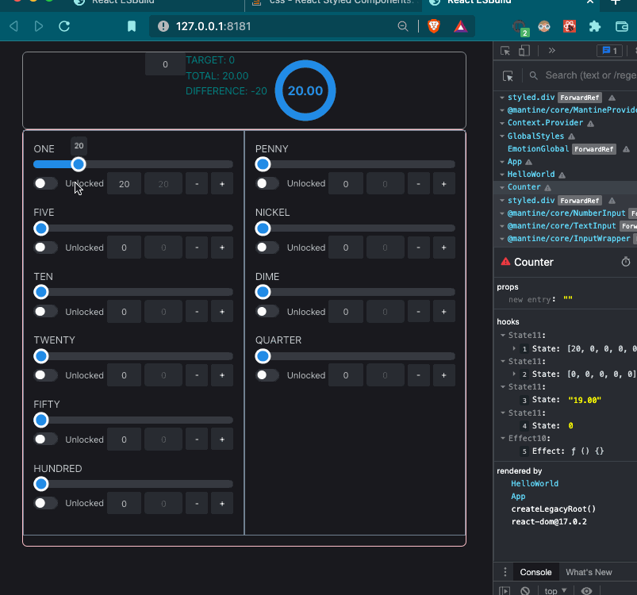

# eos Currency Counter

> This is a template for [esbuild create react app](https://github.com/awran5/esbuild-create-react-app) project.

<!--  -->

## What is inside?

- [esbuild](https://esbuild.github.io/)
- [Eslint](https://eslint.org/)
- [Prettier](https://prettier.io/)
- [Husky](https://github.com/typicode/husky)
- [lint-staged](https://github.com/okonet/lint-staged)

### License

MIT © [awran5](https://github.com/awran5/)
